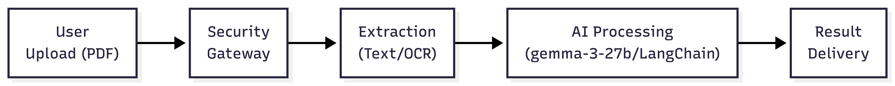
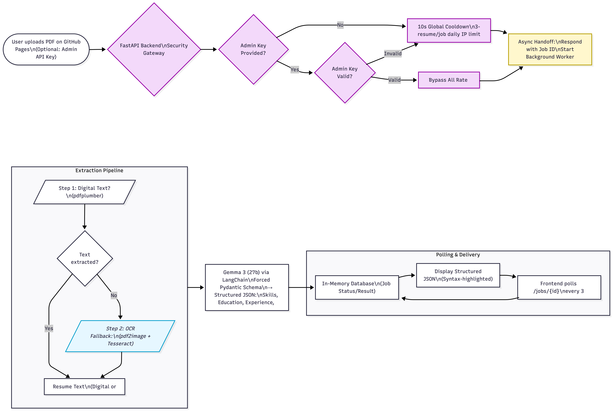

# 📄 ResumeAI: Intelligent Semantic Extractor

[](https://fastapi.tiangolo.com/)
[](https://ai.google.dev/gemma)
[](https://www.docker.com/)
[](https://render.com/)

A production-grade microservice that transforms unstructured PDF resumes into high-fidelity, structured JSON. Powered by **Gemma 3 (27b)** and architected for speed, security, and scalability.

🔗 **Live Demo:** [https://AksShri2004.github.io/resume_extractor/](https://AksShri2004.github.io/resume_extractor/)



---

## 🚀 The Core Engine: Gemma 3
This service leverages **Gemma 3 (27b)**, Google’s latest state-of-the-art open-weights model. By utilizing LangChain's structured output parsing, the engine achieves:
- **99% Schema Adherence:** Forced Pydantic validation ensures the JSON output never breaks.
- **Contextual Awareness:** Smart extraction of Skills, Projects, and Experience even from complex layouts.
- **Multi-modal fallback:** Uses Tesseract OCR to "read" scanned images of resumes.

---

## 🛠️ Technical Architecture

### 1. The Processing Pipeline
1. **Ingestion:** API accepts PDF via Multipart form-data.
2. **Security Layer:** Validates Master Key or applies Guest Rate Limits.
3. **Extraction:** 
   - **Layer 1:** Digital text extraction via `pdfplumber`.
   - **Layer 2 (Fallback):** Scanned PDF processing via `pdf2image` + `Tesseract OCR`.
4. **AI Inference:** Raw text is processed by Gemma 3 to generate semantic entities.
5. **Storage:** Results are temporarily stored in an in-memory `jobs_db`.

### 2. Security & Anti-DDoS
Designed to be public-facing while protecting API quotas:
- **IP-Based Quota:** Guest users are limited to **3 resumes per day**.
- **Global Cooldown:** A mandatory **10-second wait** between guest requests to prevent rapid-fire spam.
- **Admin Bypass:** Use a private `X-API-Key` to bypass all rate limits and cooldowns.



---

## 📖 API Documentation

### Base URL
`https://resume-extractor-5uc5.onrender.com/v1`

### Endpoints

| Method | Endpoint | Description | Auth | 
| :--- | :--- | :--- | :--- |
| `POST` | `/parse` | Upload PDF and start extraction | Optional |
| `GET` | `/jobs/{id}` | Poll for extraction results | Optional |
| `GET` | `/health` | Check service status | None |

#### 1. Submit a Resume
```bash
curl -X POST "https://resume-extractor-5uc5.onrender.com/v1/parse" \
     -H "X-API-Key: YOUR_ADMIN_KEY" \
     -F "file=@resume.pdf"
```
*Note: `X-API-Key` header is optional for guest access.*

#### 2. Get Results
```bash
curl -X GET "https://resume-extractor-5uc5.onrender.com/v1/jobs/{job_id}"
```

---

## 💻 Programmatic Integration

### Python Example
```python
import requests
import time

API_URL = "https://resume-extractor-5uc5.onrender.com/v1"

# 1. Start Extraction
with open("my_resume.pdf", "rb") as f:
    res = requests.post(f"{API_URL}/parse", files={"file": f})
    job_id = res.json()["job_id"]

# 2. Poll for JSON
while True:
    data = requests.get(f"{API_URL}/jobs/{job_id}").json()
    if data["status"] == "completed":
        print(data["result"])
        break
    time.sleep(5)
```

---

## 🏗️ Local Development

### Prerequisites
- Python 3.11+
- Tesseract OCR & Poppler (`brew install tesseract poppler`)
- Google AI Studio API Key

### Setup
```bash
git clone https://github.com/AksShri2004/resume_extractor.git
cd resume_extractor
python3 -m venv .venv
source .venv/bin/activate
pip install -r requirements.txt
uvicorn app.main:app --reload
```

---

## 📜 License & Author
Built with ❤️ by **Akshat Shrivastava**
- **GitHub:** [@AksShri2004](https://github.com/AksShri2004)
- **Engine:** Gemma 3 (27b)
- **Deployment:** Docker, Render, & GitHub Pages
